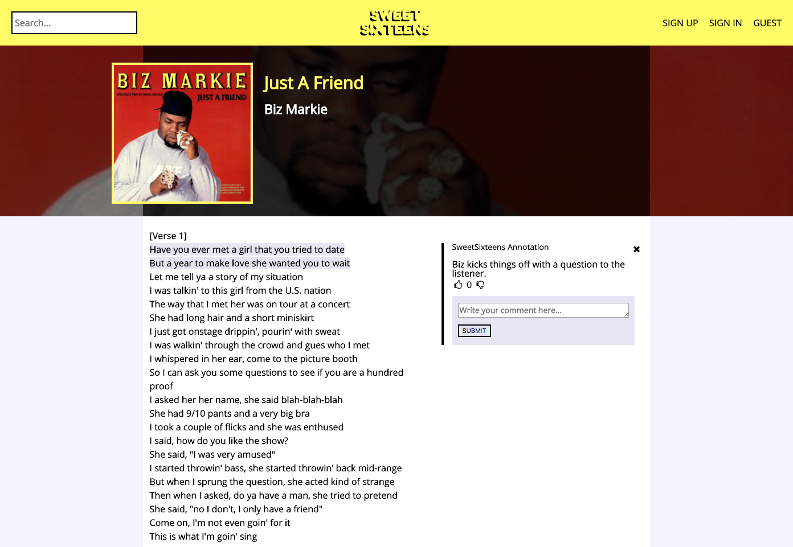
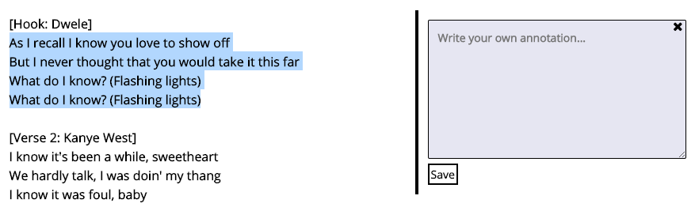
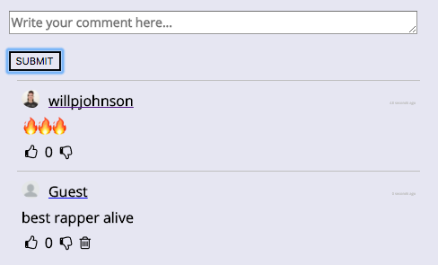
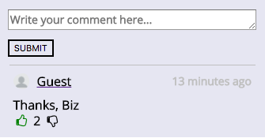

# SweetSixteens

[SweetSixteens][heroku]

[heroku]: http://sweetsixteens.herokuapp.com/#/

SweetSixteens is a full-stack web application inspired by Genius.  It utilizes Ruby on Rails on the backend, a PostgreSQL database, and React.js with a Redux architectural framework on the frontend.  

## Features and Implementation

The primary feature of this application is song lyric annotation. SweetSixteens is a community curated database for information, opinions, and analysis of lyrics. This is brought to life through extensive user interaction. Users can add tracks to the database which, in turn, can be annotated by other users who have deeper information about specific sections. To foster further interaction, all tracks and annotations can be commented on and all annotations and comments can be up or down voted. Here is a breakdown of some of the foremost features:

* Track Index Page (Home Page)
  * Navbar
    * Search (live search)
    * User info (links to log in if logged out, user dropdown if logged in)
  * List of top 10 tracks
* Track Show Page
  * Annotated lyrics
  * Comment section at bottom
* Track Annotation
  * Upvotes and Downvotes
  * Comment section at the bottom
* Comment Section
  * Upvotes and Downvotes
* Add Track Page
  * Submit new track with artist, title, lyrics, tags, and track art
* User Page
  * Displays user avatar and information
  * Link to edit user form

### Track Annotation

The focus of every track page are the lyrics. The lyrics are fetched from the database as one big string. However, in order to separate the sections of lyrics that are annotated from the ones that are not, some frontend parsing is required. The lyrics are displayed as follows:



Annotated sections receive a light blue highlight that, when clicked, open up the annotation window on the right. The way this is done is through one extensive iteration throughout the entire "lyrics" string. The bulk of the work is done in the following while loop.

```javascript
while (i < lyrics.length) {
  if (this.starts.includes(i)) {
    hasAnno = true;
    segs.push(<span name={segsIndex} key={segsIndex} onClick={this.handleSelection} className="reg-lyric-span">{regSeg}</span>);
    segsIndex += 1;
    regSeg = "";
  } else if (this.ends.includes(i)) {
    hasAnno = false;
    segs.push(<span name={segsIndex} key={segsIndex} id={this.annoIds[i]} className="anno-lyric-span"
      onClick={this.handleAnno}>{annoSeg}</span>);
    segsIndex += 1;
    annoSeg = "";
    annoIdsIndex += 1;
  }

  if (hasAnno) {
    annoSeg += lyrics[i];
  } else {
    regSeg += lyrics[i];
  }

  i += 1;
}
```

Every annotation has a start index and end index property, which I've put into arrays. As the while loop iterates through all the lyric characters, it checks to see if the character index is either an annotation start index or an annotation end index. If it is, it flips the switch on a boolean called "hasAnno" which indicates whether future characters are in an annotated segment or not. Ultimately, every character will be placed into one of two types of html spans: annotated or regular. This collection of spans is ultimately what is rendered on the page.

When viewing a track's lyrics, a user may also decide to write an annotation of their own on a segment that is untouched.



By selecting a section of text, a user causes a popup "Create Annotation" window to appear on the right. The user can then type in their notes and assign it to start and end indexes of the selection via some iteration over the spans as previously established in the previous section (note that the spans have a 'name' property that simply indicates their index in the array of spans).

```javascript
let selectionStartIdx = window.getSelection().anchorOffset;
let selectionEndIdx = window.getSelection().focusOffset;
const currentSeg = parseInt(e.currentTarget.getAttribute('name'));

let i = 0;

while (i < currentSeg) {
  let testSeg = document.getElementsByName(i);
  let testSegLength = testSeg[0].innerHTML.length;

  selectionStartIdx += testSegLength;
  selectionEndIdx += testSegLength;

  i += 1;
}
```

With this functionality, users can add their two cents to any song in the database (or even add their own song).

### Comments and Upvotes

While annotation is certainly the purpose of the app, commenting and upvoting allow for a community of like-minded users to all contribute their input.

Comments can be created on either annotations or tracks by any logged in user. The form is just a simple text input which immediately appends new comments to the bottom of the <ul>.



If a user is logged in, they can choose to upvote or downvote any comment. If a user is logged in as the author of the comment, they are able to delete the comment from the database.

Users can upvote or downvote any comment or annotation. All votable components also display their current 'score', or sum total of up and down votes.



With these two features, SweetSixteens becomes a truly immersive social experience as well as a helpful annotation tool.

## Future Direction

In addition to the features demonstrated, I would like to add the following functionality to SweetSixteens in the future.

### Tagging

I would like to add a robust tagging system where users can tag tracks with genre data for easy search and comparison.

### Streaming

The track pages could benefit from having a streaming component to play audio or video of the track in question while you read the lyrics and annotations. 
